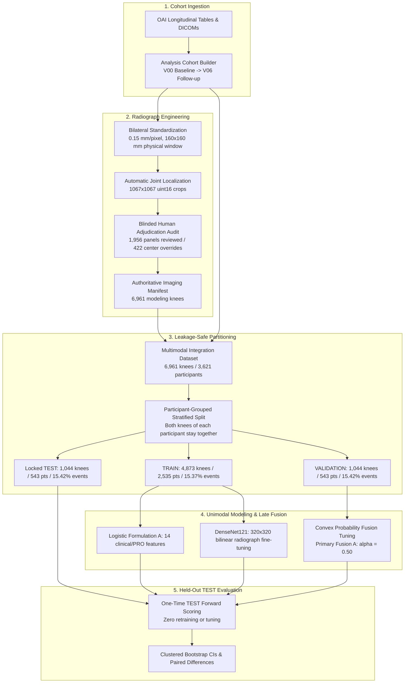

# Multimodal Knee Osteoarthritis Progression Pipeline

A reproducible machine learning and deep learning research pipeline investigating whether multimodal integration of baseline digital knee radiographs, clinical risk factors, patient-reported symptoms, and objective physical-function tests improves prediction of ~48-month knee osteoarthritis (OA) progression over unimodal baselines using access-controlled data from the Osteoarthritis Initiative (OAI).

---

## Research Question

> **Can baseline knee radiographs, clinical/demographic factors, patient-reported outcomes, and physical-function measurements predict approximately 48-month structural knee OA progression?**

Knee osteoarthritis is a heterogeneous joint disease characterized by progressive cartilage degradation, subchondral bone remodeling, and osteophyte formation. Identifying knees at high risk of structural failure before irreversible radiographic damage occurs is essential for clinical trial enrichment and targeted early intervention.

---

## Dataset & Scope

- **Data Source:** The Osteoarthritis Initiative (OAI), a longitudinal, multicenter prospective observational study of knee OA.
- **Analytical Unit:** The **participant-knee** ($N = 6,961$ knees across $3,621$ unique participants).
- **Time Horizon:** Baseline visit (**V00**) to nominal 48-month follow-up (**V06**; ~48-month boundary).
- **Inclusion / Exclusion:** Knees with baseline Kellgren-Lawrence (KL) grades 0–3 were eligible; baseline KL 4 (end-stage OA) knees were excluded.
- **Primary Endpoint:** Binary **composite progression** over ~48 months, defined as central radiographic KL worsening ($\Delta\text{KL} \ge 1$) or qualifying total/partial knee replacement prior to V06.
- **Data Governance & Attribution:** Raw DICOM archives and derived participant-level datasets are **access-controlled research data**. Source data are subject to OAI access and research use terms and are not publicly distributed. Prepared using an OAI public-use dataset (NIH/NIAMS contracts N01-AR-2-2258 through 2262); see [docs/data_access_and_privacy.md](docs/data_access_and_privacy.md) for official acknowledgments and access procedures.

---

## Pipeline Architecture



---

## Modeling Cohort Census

Participants were deterministically allocated into participant-grouped partitions to prevent bilateral or longitudinal leakage:

| Partition | Knees ($N$) | Unique Participants | Progression Events ($Y=1$) | Event Rate (%) | Partition Role |
|---|---|---|---|---|---|
| **TRAIN** | 4,873 | 2,535 | 749 | 15.370% | Model parameter estimation and train-only transforms |
| **VALIDATION** | 1,044 | 543 | 161 | 15.421% | Hyperparameter tuning and fusion weight $\alpha$ selection |
| **TEST** | 1,044 | 543 | 161 | 15.421% | One-time held-out evaluation; locked until final freeze |
| **Full Cohort** | **6,961** | **3,621** | **1,071** | **15.386%** | **Sole authoritative modeling population** |

---

## Integrated Modalities

1. **Baseline Knee Radiographs:** Digital fixed-flexion knee radiographs standardized to $0.15\text{ mm/pixel}$ and $160 \times 160\text{ mm}$ anatomical joint crops ($1,067 \times 1,067$ uint16), fine-tuned through DenseNet121 at $320 \times 320$ resolution.
2. **Clinical & Demographic Factors:** Age, biological sex, BMI, prior index surgery history, and family knee replacement history.
3. **Patient-Reported Outcomes (PROs):** WOMAC pain, stiffness, and disability subscales; KOOS pain and symptoms subscales.
4. **Objective Physical Function:** 20-meter walking pace, repeated chair-stand completion time, and isometric knee extension and flexion strength.
5. **Prespecified Baseline KL Sensitivity:** Baseline Kellgren-Lawrence grade was excluded from the primary tabular model (Formulation A) by prespecified design and evaluated strictly within secondary sensitivity models (Formulation B).

---

## Final Held-Out TEST Results

Evaluated once on the locked held-out TEST cohort ($N = 1,044$ knees, $161$ events, $15.4215\%$ prevalence) with 1,000 participant-clustered bootstrap replicates:

| Model Architecture | Input Modalities | AUROC | AUPRC | Brier Score | Log Loss |
|---|---|---|---|---|---|
| **Logistic Formulation A** | 14 Clinical / PRO / Function features | **0.644** | **0.236** | **0.127** | 0.415 |
| **DenseNet121 Candidate 2** | Baseline standardized knee radiograph | **0.732** | **0.371** | **0.118** | 0.391 |
| **Primary Multimodal Fusion A** | Convex late fusion ($\alpha = 0.50$) | **0.728** | **0.368** | **0.118** | 0.387 |

*(Detailed participant-clustered bootstrap confidence intervals, paired difference distributions, and calibration diagnostics are documented in [docs/final_results.md](docs/final_results.md)).*

### Key Scientific Finding
> **The deep learning imaging model provided the strongest point discrimination on the held-out TEST cohort (AUROC 0.732). Multimodal Fusion A substantially improved performance over the tabular clinical baseline ($\Delta\text{AUROC} = +0.085$, 95% paired CI $[+0.047, +0.121]$), but performed similarly to the standalone image-only model ($\Delta\text{AUROC} = -0.004$, 95% paired CI $[-0.027, +0.019]$). Multimodal fusion did not clearly outperform deep learning on baseline knee radiographs alone.**

*Note on Validation-to-TEST Image Discrimination:* The image model's discrimination was higher on the held-out TEST partition (TEST AUROC = 0.731963) than on validation (VALIDATION AUROC = 0.677856; Delta = +0.054107). This difference may reflect partition-specific sampling variability. The pattern does not by itself establish a generalization gain and reinforces the need for external cohort validation. No known split or preprocessing leakage was identified in the project's existing leakage audits.

---

## Diagnostic Evaluation Curves

Aggregate evaluation curves generated during the single held-out TEST evaluation:

| ROC Curves | Precision-Recall Curves | Calibration Curves |
|:---:|:---:|:---:|
|  |  |  |

---

## Reproducibility & Public Verification

This repository enforces a three-tier reproducibility framework:
1. **Code-Level Verification (Default Public Profile):** Full portable test suite, type annotations, formatting, and linters run out-of-the-box using synthetic fixtures without requiring access to OAI data packages.
2. **Authorized-Data Reproduction:** Researchers with authorized OAI access can execute the complete end-to-end pipeline from raw archives to model training.
3. **Frozen Historical TEST Evaluation:** The one-time held-out TEST evaluation is preserved as an immutable historical record locked by cryptographic hashes and is not rerun during routine testing.

### Quickstart Public Verification

Requirements: **Python 3.13** (verified on Python 3.13.2) and **Node.js >= 18** (for UI rapid-review harness tests).

```bash
# 1. Create and activate a clean virtual environment
python3 -m venv .venv
source .venv/bin/activate

# 2. Install package in editable mode with development and modeling dependencies
pip install --upgrade pip
pip install -e ".[dev,modeling,image_modeling]"

# 3. Run the portable public test suite
pytest -m public_portable

# 4. Run linter and formatting checks
ruff check .
ruff format --check .
```

For maintainer verification against local research state or full data pipelines, see [docs/reproducibility.md](docs/reproducibility.md).

---

## Documentation Navigation

- [Project Overview](docs/project_overview.md): Executive summary and clinical motivation.
- [Study Methodology](docs/methodology.md): Analytical unit, inclusion/exclusion, outcome definitions, and leakage controls.
- [Cohort & Outcomes](docs/cohort_and_outcomes.md): Participant-knee census, split flow, and modality completeness.
- [Imaging Pipeline](docs/imaging_pipeline.md): DICOM standardization, joint localization, human adjudication, and transforms.
- [Modeling & Evaluation](docs/modeling_and_evaluation.md): Model architectures, tabular features, probability fusion, and bootstrap protocol.
- [Final Results](docs/final_results.md): Full held-out TEST results, sensitivity analyses, and paired comparative intervals.
- [Limitations](docs/limitations.md): Scientific, methodological, and clinical limitations.
- [Data Access & Privacy](docs/data_access_and_privacy.md): OAI data governance, access terms, and participant privacy safeguards.
- [Repository Structure](docs/repository_structure.md): Code organization, configs, and local data layout.
- [Portfolio Summary](docs/portfolio_summary.md): Recruiter- and interviewer-focused project summary.

---

## License

The software in this repository is licensed under the Apache License 2.0. See the [LICENSE](LICENSE) file for the full license text.

The Osteoarthritis Initiative (OAI) source data used in this study are governed separately by their applicable access and data-use terms and are not distributed or relicensed by this repository.

---

## Project Status

- **Research status:** COMPLETE
- **Final held-out TEST evaluation:** COMPLETE AND FROZEN
- **Public repository status:** NOT YET RELEASED
- **Access-controlled OAI data:** NOT DISTRIBUTED

