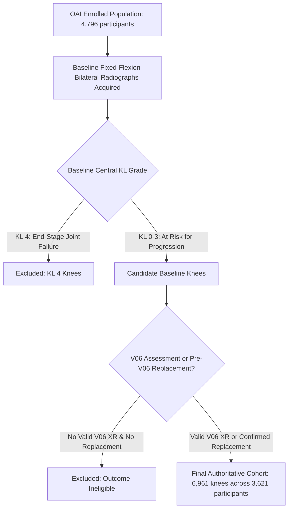

# Cohort Construction & Outcome Definitions

This document details the cohort selection flow, participant-knee census, modality completeness, and clinical outcome definitions for the multimodal knee OA pipeline.

---

## 1. Cohort Construction & Flow

Starting from the entire enrolled OAI baseline cohort, participants and knees were filtered through prespecified inclusion and quality criteria:

### Cohort Breakdown by Contribution
- **Bilateral Participants:** $3,340$ participants contribute both knees ($6,680$ total knees).
- **Unilateral Participants:** $281$ participants contribute one eligible knee ($281$ total knees).
- **Total Analytical Cohort:** **6,961 knees** from **3,621 unique participants**.

---

## 2. Split Partition Census

The participant-grouped split assigns participants deterministically into three mutually exclusive subsets. Both knees of every bilateral participant are assigned to the same partition.

| Attribute | TRAIN | VALIDATION | TEST | Full Cohort |
|---|---|---|---|---|
| **Total Knees ($N$)** | 4,873 | 1,044 | 1,044 | **6,961** |
| **Unique Participants** | 2,535 | 543 | 543 | **3,621** |
| **Participant Share (%)** | 70.01% | 15.00% | 15.00% | **100.0%** |
| **Knee Share (%)** | 70.00% | 15.00% | 15.00% | **100.0%** |
| **Composite Progression Events ($Y=1$)** | **749** | **161** | **161** | **1,071** |
| **Event Prevalence (%)** | **15.370%** | **15.421%** | **15.421%** | **15.386%** |
| **Left Knees** | 2,434 (49.95%) | 524 (50.19%) | 524 (50.19%) | **3,482 (50.02%)** |
| **Right Knees** | 2,439 (50.05%) | 520 (49.81%) | 520 (49.81%) | **3,479 (49.98%)** |

### Stratified Participant Distribution
Participants were stratified across 5 non-sparse combinations of eligible knee count and positive event burden:
- **$(1 \text{ knee}, 0 \text{ events}):$** $178$ participants ($124$ Train, $27$ Val, $27$ Test)
- **$(1 \text{ knee}, 1 \text{ event}):$** $103$ participants ($73$ Train, $15$ Val, $15$ Test)
- **$(2 \text{ knees}, 0 \text{ events}):$** $2,538$ participants ($1,776$ Train, $381$ Val, $381$ Test)
- **$(2 \text{ knees}, 1 \text{ event}):$** $636$ participants ($446$ Train, $95$ Val, $95$ Test)
- **$(2 \text{ knees}, 2 \text{ events}):$** $166$ participants ($116$ Train, $25$ Val, $25$ Test)

---

## 3. Multimodal Completeness Audit

Completeness across the four baseline feature domains was audited directly from the frozen dataset (`missingness_audit.json`):
1. **Standardized Radiographs (Imaging):** $100\%$ complete ($6,961 / 6,961$ knees). Every modeling knee is mapped to an authoritative, QC-verified standardized joint crop.
2. **Clinical & Demographic Factors:** $98.33\%$ complete ($6,845 / 6,961$ knees). Non-missing across age, sex, BMI, surgical history, and family replacement history. Complete baseline clinical assessment was not an implemented eligibility criterion.
3. **Patient-Reported Outcomes (PROs):** $99.58\%$ complete ($6,932 / 6,961$ knees). High completion across baseline WOMAC (pain, stiffness, disability) and KOOS (pain, symptoms) subscales.
4. **Physical Function Tests:** $85.46\%$ complete ($5,949 / 6,961$ knees). Reflects participant mobility limitations or site protocol exemptions during 20-meter walk, chair stand, and knee strength dynamometry.
5. **All Four Modalities Simultaneously Complete:** $83.91\%$ ($5,841 / 6,961$ knees). Missing values are handled via train-fitted median imputation for numeric features and most-frequent imputation for categorical features, with **no added missingness indicator features**. Complete case filtering was not performed.

---

## 4. Outcome Details & Clinical Relevance

### Primary Composite Endpoint
$$\text{composite\_progression} = \Delta\text{KL} \ge 1 \lor \text{replacement\_before\_v06}$$

- **Clinical Rationale:** The composite endpoint captures meaningful structural disease progression over approximately 48 months. Combining radiographic worsening with surgical knee replacement avoids informative right-censoring: knees that deteriorate rapidly to total knee arthroplasty often lack follow-up radiographs because the native joint is no longer present.
- **Implemented Replacement Qualification Rule:** Documented post-baseline knee replacement qualifies if the replacement date is strictly after the baseline radiograph date, timing is resolved relative to the baseline visit, and the replacement date occurs on or before the V06 boundary date (the V06 radiograph date if acquired, or the 48-month scheduled boundary date from baseline if no V06 radiograph was acquired). In accordance with `builder.py`, surgical sub-type classification or external adjudication confirmation fields were not required for qualification.
- **Replacement Distribution:** A total of **110 knees** qualify under the replacement branch across the cohort ($79$ in TRAIN, $18$ in VALIDATION, and $13$ in TEST). These 110 events represent the complete qualifying replacement branch.

### Secondary Endpoints (Evaluated Descriptively)
- **Radiographic KL Progression Alone:** $961$ events across $6,851$ knees with paired V00/V06 radiographs ($14.027\%$).
- **Joint Space Narrowing (JSN) Progression:** $734$ events across $6,851$ knees ($10.714\%$), defined as medial or lateral OARSI JSN worsening $\ge 1$ grade. JSN serves as a secondary structural sensitivity endpoint.
- **Qualifying Replacement Alone:** $110$ total events across the cohort ($79$ TRAIN, $18$ VALIDATION, $13$ TEST).
