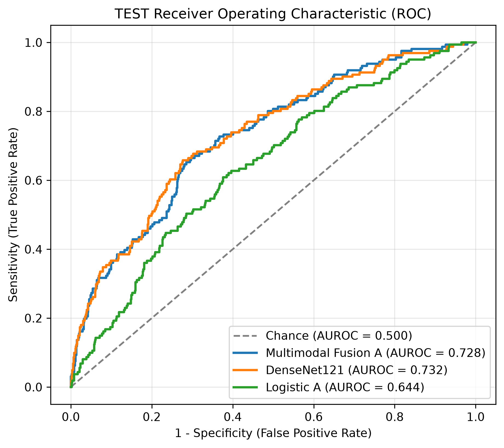
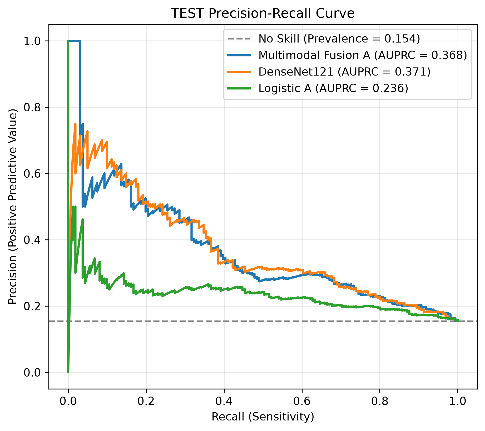
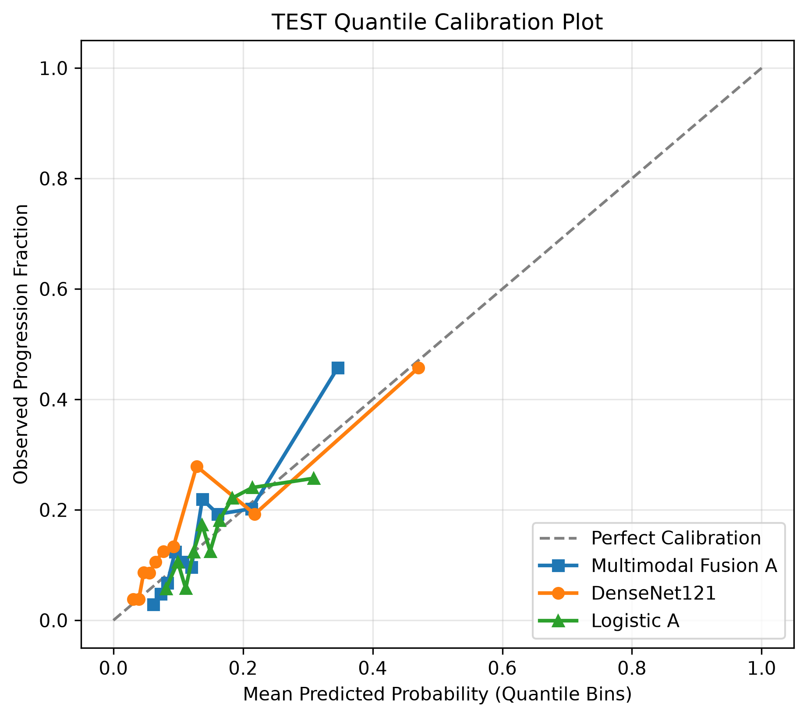

# Final Results: Held-Out TEST Evaluation

This document presents the complete, frozen scientific results from the one-time held-out TEST evaluation of the multimodal knee osteoarthritis progression prediction pipeline.

---

## 1. Held-Out TEST Cohort Census

The TEST partition was evaluated under participant-grouped, outcome-stratified held-out governance with a strict development embargo:
- **Total Evaluated Knees:** 1,044
- **Total Unique Participants:** 543
- **Positive Progression Events ($Y=1$):** 161
- **Empirical Prevalence:** 15.4215% (0.154215)
- **Zero Leakage:** Complete participant isolation from TRAIN and VALIDATION.

---

## 2. Primary Model Performance

Performance metrics were computed across all $1,044$ TEST knees. Confidence intervals are derived from **1,000 participant-clustered bootstrap replicates** (seed **65027**):

| Evaluation Metric | Logistic Formulation A (Primary Tabular) | DenseNet121 Candidate 2 (Primary Image) | Multimodal Fusion A ($\alpha = 0.50$, Primary) |
|---|---|---|---|
| **AUROC [95% CI]** | **0.643582** [0.595077, 0.689084] | **0.731963** [0.684374, 0.773632] | **0.728164** [0.679842, 0.770590] |
| **AUPRC [95% CI]** | **0.236237** [0.190498, 0.300165] | **0.371287** [0.293339, 0.461439] | **0.367969** [0.289785, 0.450085] |
| **Brier Score [95% CI]** | **0.126882** [0.111868, 0.143360] | **0.117505** [0.102270, 0.134993] | **0.117951** [0.103593, 0.134592] |
| **Log Loss** | 0.415345 | 0.390618 | 0.387339 |
| **Calibration Intercept** | -0.0446 | -0.0351 | +0.6561 |
| **Calibration Slope** | 0.9869 | 0.8035 | 1.3184 |
| **Observations ($N$)** | 1,044 | 1,044 | 1,044 |
| **Positive Events** | 161 | 161 | 161 |
| **Prevalence** | 15.4215% | 15.4215% | 15.4215% |

---

## 3. Prespecified Sensitivity Analyses (Baseline KL Included)

Formulation B explicitly tests the incremental utility of including baseline radiographic damage (`baseline_kl` 0–3) within the tabular feature set:

| Evaluation Metric | Logistic Formulation B (+ Baseline KL) | Multimodal Fusion B ($\alpha = 0.60$) |
|---|---|---|
| **Role** | BASELINE-KL SENSITIVITY | BASELINE-KL SENSITIVITY |
| **AUROC** | **0.685667** | **0.735149** |
| **AUPRC** | **0.269416** | **0.373690** |
| **Brier Score** | **0.123897** | **0.116845** |
| **Log Loss** | 0.404365 | 0.383931 |
| **Calibration Intercept** | +0.2871 | +0.4020 |
| **Calibration Slope** | 1.1878 | 1.1409 |
| **Observations ($N$)** | 1,044 | 1,044 |
| **Positive Events** | 161 | 161 |

*Note: In accordance with prespecified governance, Fusion B is retained strictly as a secondary sensitivity analysis and is not promoted over primary Fusion A.*

---

## 4. Paired Comparative Intervals

Paired comparative differences ($\Delta = \text{Model}_1 - \text{Model}_2$) were calculated within each of the 1,000 participant-clustered bootstrap draws, capturing joint participant-level covariance:

### A. Multimodal Fusion A minus DenseNet121 (Primary Image)
- **$\Delta$ AUROC:** Observed = **-0.003798**, Bootstrap Median = -0.004079, 95% Interval = **[-0.026579, +0.018623]**
- **$\Delta$ AUPRC:** Observed = **-0.003317**, Bootstrap Median = -0.005460, 95% Interval = **[-0.040487, +0.026457]**
- **$\Delta$ Brier:** Observed = **+0.000446**, Bootstrap Median = +0.000451, 95% Interval = **[-0.003076, +0.003971]**

### B. Multimodal Fusion A minus Logistic Formulation A (Primary Tabular)
- **$\Delta$ AUROC:** Observed = **+0.084582**, Bootstrap Median = +0.083689, 95% Interval = **[+0.047153, +0.120964]**
- **$\Delta$ AUPRC:** Observed = **+0.131733**, Bootstrap Median = +0.129175, 95% Interval = **[+0.072019, +0.187964]**
- **$\Delta$ Brier:** Observed = **-0.008932**, Bootstrap Median = -0.008917, 95% Interval = **[-0.012948, -0.005193]**

*(Note: These intervals represent empirical descriptive bootstrap distributions; no formal null-hypothesis testing or p-values are claimed).*

---

## 5. Validation vs. TEST Generalization

Comparison of model performance across the independent VALIDATION partition ($N = 1,044$) and held-out TEST partition ($N = 1,044$):

| Model | Val AUROC | TEST AUROC | $\Delta$ AUROC | Val AUPRC | TEST AUPRC | $\Delta$ AUPRC | Val Brier | TEST Brier | $\Delta$ Brier |
|---|---|---|---|---|---|---|---|---|---|
| **Logistic A** | 0.651692 | 0.643582 | -0.008110 | 0.248999 | 0.236237 | -0.012762 | 0.125928 | 0.126882 | +0.000954 |
| **DenseNet121** | 0.677856 | 0.731963 | +0.054107 | 0.295103 | 0.371287 | +0.076184 | 0.125439 | 0.117505 | -0.007934 |
| **Fusion A** | 0.700105 | 0.728164 | +0.028059 | 0.304799 | 0.367969 | +0.063170 | 0.122227 | 0.117951 | -0.004276 |
| **Logistic B** | 0.663953 | 0.685667 | +0.021714 | 0.248517 | 0.269416 | +0.020899 | 0.125480 | 0.123897 | -0.001583 |
| **Fusion B (Archival)** \* | 0.703276 | 0.735149 | +0.031873 | 0.298246 | 0.373690 | +0.075444 | 0.122188 | 0.116845 | -0.005343 |

*\* Note on Fusion B Validation Row:* As documented in [ERRATA.md](results/ERRATA.md), `validation_vs_test_summary.json` is preserved byte-for-byte as an archival recovered artifact. Its Fusion B validation presentation (0.703276) does not match the authoritative selected sensitivity model ($\alpha = 0.60$), whose frozen validation metrics are AUROC **0.694892**, AUPRC **0.299284**, and Brier **0.122701** ($\Delta\text{AUROC} = +0.040257$). The displayed validation-to-TEST differences are documentary arithmetic derived from the authoritative frozen validation and TEST point estimates; they are not separately recovered historical evaluation artifacts. Held-out TEST metrics are unaffected.

---

## 6. Diagnostic Evaluation Plots

Aggregate diagnostic curves were generated during the frozen TEST run:

### ROC Curves

### Precision-Recall Curves

### Calibration Curves

---

## 7. Scientifically Honest Interpretation

1. **Imaging Model Performance:**  
   The deep learning model trained on baseline knee radiographs (DenseNet121) achieved the highest point discrimination (AUROC 0.732, AUPRC 0.371) on the held-out TEST cohort.
2. **Multimodal Value Over Tabular:**  
   Primary Multimodal Fusion A substantially outperformed the tabular-only baseline across all metrics ($\Delta\text{AUROC} = +0.085$, $\Delta\text{AUPRC} = +0.132$, $\Delta\text{Brier} = -0.009$).
3. **Multimodal vs. Image-Only:**  
   Multimodal Fusion A achieved an AUROC of 0.728, performing similarly to the standalone image model (difference -0.0038, 95% paired CI [-0.0266, +0.0186]). **The primary multimodal fusion did not clearly outperform the standalone image model.**
4. **Calibration Shift:**  
   Unimodal models exhibited good calibration slopes (0.987 for Logistic A, 0.804 for DenseNet121). Simple linear probability averaging produced a positive calibration intercept (+0.656) and steeper slope (1.318) in Fusion A, indicating that unpenalized probability mixing without recalibration can shift baseline probability calibration.
5. **Validation-to-TEST Discrimination Dynamics:**  
   The image model's discrimination was higher on the held-out TEST partition (TEST AUROC = 0.731963) than on validation (VALIDATION AUROC = 0.677856; Delta = +0.054107). This difference may reflect partition-specific sampling variability. The pattern does not by itself establish a generalization gain and reinforces the need for external cohort validation. No known split or preprocessing leakage was identified in the project's existing leakage audits.

---

## 8. Provenance & Archival Recovery Note

The single held-out TEST evaluation completed all forward inferences, metric calculations, participant-clustered bootstrap resampling, paired comparisons, and PNG plot generation in a single pass. Execution halted during post-scoring generalization summary serialization due to a dictionary key mismatch (`KeyError: 'sensitivity_models'`).

Under strict scientific governance, no scoring code was modified and no scientific computations were rerun. In accordance with archival recovery provenance:
- Aggregate summaries were serialized during archival recovery from retained first-run recorded values.
- Participant-level frozen prediction parquets (`aligned_test_predictions.parquet`, `test_tabular_predictions.parquet`, `test_image_predictions.parquet`) remained preserved privately.
- Replicate-level bootstrap sample draws were not persisted to disk; only summary percentile intervals and median paired differences are publicly available in `clustered_bootstrap.json` and `paired_bootstrap_differences.json`.
- Cryptographic SHA-256 digests prove post-creation artifact integrity, rather than independent recomputation of the original in-memory state.
- Zero models were retrained, refitted, or re-evaluated.
