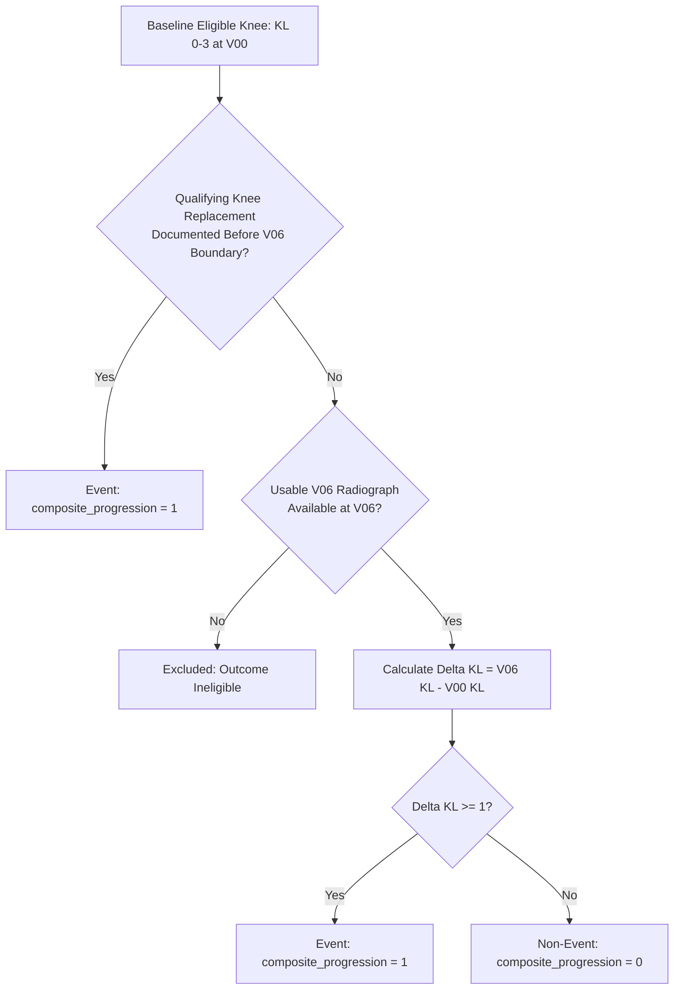

# Study Methodology: Multimodal Knee OA Progression Pipeline

This document details the epidemiological and computational study methodology for predicting 48-month structural knee osteoarthritis progression.

---

## 1. Study Population & Analytical Unit

The study utilizes longitudinal data from the Osteoarthritis Initiative (OAI), a prospective observational cohort study.

- **Analytical Unit:** The **participant-knee** joint.
- **Bilateral Structure:** Participants may contribute up to two knees (left and right). Across the $3,621$ eligible participants, $3,340$ contribute bilateral knees ($6,680$ knees) and $281$ contribute unilateral knees ($281$ knees), yielding a total cohort of **6,961 knees**.
- **Time Horizon:** Baseline visit (**V00**) to nominal 48-month follow-up visit (**V06**; ~48-month boundary).

---

## 2. Eligibility Criteria & Cohort Selection

### Inclusion Criteria
1. Enrollment in the prospective OAI observational cohort. Complete baseline clinical assessment was not an eligibility filter; non-missingness across all covariates was not required, and missing values were accommodated via train-fitted imputation.
2. Usable baseline fixed-flexion bilateral knee radiograph acquired at V00.
3. Baseline Kellgren-Lawrence (KL) grade between **0 and 3** inclusive.
4. Documented longitudinal outcome assessment at V06 (usable V06 radiograph) or qualifying knee replacement prior to or on the V06 boundary date.

### Exclusion Criteria
1. **Baseline End-Stage OA (KL 4):** Knees with baseline KL grade 4 are excluded because Kellgren-Lawrence grade progression beyond 4 is impossible by definition, and severe joint space loss represents pre-existing joint failure.
2. **Missing Longitudinal Outcome:** Knees lacking both a usable V06 radiograph and qualifying knee replacement documentation prior to or on the V06 boundary date are classified as outcome-ineligible and excluded.

---

## 3. Outcome Definitions

All radiographic endpoint readings use the centrally adjudicated OAI Project 15 (`READPRJ = 15`) standardized readouts. Project readings are never pooled across discordant reading campaigns.

### A. Authoritative Primary Endpoint: Composite Progression
The prespecified primary target is binary **composite progression** at approximately 48 months:
$$\text{composite\_progression} = \text{radiographic\_kl\_progression} \lor \text{replacement\_before\_v06}$$

Where:
- **Radiographic KL Progression:** An increase in central Kellgren-Lawrence grade of at least one full integer grade from baseline to V06:
  $$\Delta\text{KL} = \text{KL}_{\text{V06}} - \text{KL}_{\text{V00}} \ge 1$$
- **Qualifying Knee Replacement:** Documented post-baseline knee replacement occurring on the index knee before or on the V06 boundary date (the V06 radiograph date if acquired, or the 48-month scheduled boundary date from baseline if no V06 radiograph was acquired). In accordance with `builder.py`, qualification requires that the replacement date is strictly after the baseline radiograph date with resolved timing relative to baseline; surgical subtype classification or external adjudication confirmation fields were not required.
- **Census:** Across the $6,961$ modeling knees, there are **1,071 composite progression events** ($15.386\%$ prevalence). Among these, $961$ progress via central radiographic KL worsening ($\Delta\text{KL} \ge 1$) and $110$ represent the complete qualifying replacement branch occurring before or on the V06 boundary.

### B. Secondary / Sensitivity Endpoints
1. **OARSI Joint Space Narrowing (JSN) Progression:**  
   $$\text{jsn\_progression} = (\Delta\text{JSN}_{\text{medial}} \ge 1) \lor (\Delta\text{JSN}_{\text{lateral}} \ge 1)$$
   Evaluated on knees with usable numeric medial/lateral JSN grades (0–3) at both visits. **JSN progression is strictly a secondary/sensitivity endpoint and is NOT part of the primary composite progression target.**
2. **Isolated Radiographic Progression:** Evaluates $\Delta\text{KL} \ge 1$ alone, censoring pre-V06 knee replacements.
3. **Knee Replacement Before V06:** Evaluated as an isolated clinical failure endpoint.

---

## 4. Leakage-Safe Participant-Grouped Partitioning

A critical failure mode in medical imaging and longitudinal modeling is **data leakage** between bilateral knees or across longitudinal timepoints for the same individual.

- **Strict Grouping Rule:** Both knees of any participant are assigned deterministically to the **same split partition**. No participant appears in more than one partition.
- **Partitioning Algorithm:** Deterministic candidate allocation search using SHA-256 hash ranking within 5 stratified participant cohorts defined by:
  $$(\text{eligible knees per participant}, \text{event knees per participant}) \in \{(1, 0), (1, 1), (2, 0), (2, 1), (2, 2)\}$$
- **Target Proportions:** Nominal 70% TRAIN / 15% VALIDATION / 15% TEST.
- **Resulting Census:**
  - **TRAIN:** 4,873 knees, 2,535 participants, 749 events (15.370% prevalence)
  - **VALIDATION:** 1,044 knees, 543 participants, 161 events (15.421% prevalence)
  - **TEST:** 1,044 knees, 543 participants, 161 events (15.421% prevalence)
- **Zero Leakage Confirmation:** Participant pairwise set intersections ($\text{TRAIN} \cap \text{VAL}$, $\text{TRAIN} \cap \text{TEST}$, $\text{VAL} \cap \text{TEST}$) are strictly empty ($0$ participants).

---

## 5. Strict Preprocessing & Leakage Controls

To ensure unbiased generalization estimates:
1. **Train-Only Parameter Fitting:**  
   All data scalers (StandardScaler) and imputation statistics (median for numeric, most-frequent for categorical) are computed **strictly on the TRAIN partition** and applied downstream to VALIDATION and TEST. No missingness indicator features were added.
2. **Image Normalization:**  
   Standard ImageNet channel statistics (`mean=[0.485, 0.456, 0.406]`, `std=[0.229, 0.224, 0.225]`) are used for deep learning normalization. Per-image intensity percentiles (p0.5 and p99.5) are computed strictly on the individual input image itself, ensuring zero cross-image leakage.
3. **Held-Out TEST Embargo & One-Time Evaluation Gate:**  
   The held-out TEST partition remained under strict performance embargo during all feature engineering, model architecture selection, hyperparameter tuning, and probability fusion optimization. TEST performance evaluation was executed exactly once under automated fail-closed execution.

---

## 6. Scientific Scope & Predictive Non-Causality

> [!NOTE]
> **Predictive vs. Causal Interpretation:**  
> This pipeline is designed exclusively for prognostic risk prediction. Identified associations between baseline multimodal predictors and future structural progression represent correlative prognostic markers, not causal mechanisms. Interventions targeting these predictors cannot be inferred to prevent structural progression without prospective randomized interventional trials.
