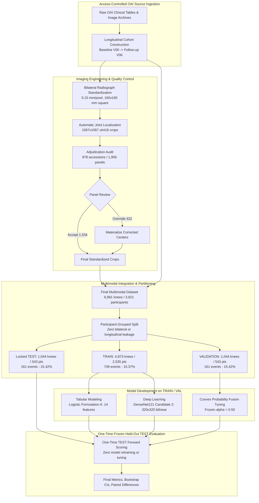

# Project Overview: Multimodal Knee Osteoarthritis Progression Pipeline

A reproducible research pipeline investigating whether baseline knee radiographs, structured clinical and demographic risk factors, patient-reported outcome measures, and physical-function tests can predict approximately 48-month knee osteoarthritis (OA) progression using access-controlled data from the Osteoarthritis Initiative (OAI).

---

## 1. Clinical Research Question

> **Primary Scientific Question:**  
> Can multimodal integration of baseline bilateral knee radiographs, clinical/demographic factors, patient-reported outcomes (WOMAC/KOOS), and objective physical-function tests improve prediction of ~48-month structural knee osteoarthritis progression over unimodal imaging or tabular baselines?

Knee osteoarthritis is a leading cause of chronic pain and mobility impairment. While radiographic severity (e.g., Kellgren-Lawrence grade) and joint space narrowing are traditional hallmarks, clinical progression is heterogeneous. Identifying knees at high risk of progression before irreversible joint failure can inform clinical trial enrichment and disease-modifying therapeutic strategies.

---

## 2. Dataset & Analytical Scope

- **Study Cohort:** The Osteoarthritis Initiative (OAI), a multicenter, prospective, longitudinal observational cohort of 4,796 participants aged 45–79 years at baseline.
- **Analytical Unit:** The **participant-knee** ($N = 6,961$ baseline-eligible knees across $3,621$ unique participants).
- **Time Horizon:** Baseline visit (**V00**) to the approximately 48-month follow-up visit (**V06**; nominal 48-month boundary).
- **Data Governance:** Raw DICOMs, clinical tables, and derived participant-level records are **access-controlled research data**. Source data are subject to OAI access and usage terms with strict redistribution restrictions; all participant-level datasets are maintained locally and excluded from public distribution.

---

## 3. End-to-End Pipeline Architecture

The pipeline enforces complete separation of data ingestion, standardized preprocessing, human quality control, leakage-safe participant-grouped partitioning, unimodal modeling, and probability fusion:

---

## 4. Modeling Cohort Census

The final cohort consists of baseline Kellgren-Lawrence (KL) grades 0–3 knees with confirmed follow-up or documented pre-V06 knee replacement:

| Partition | Knees ($N$) | Unique Participants | Progression Events ($Y=1$) | Event Rate (%) | Split Role |
|---|---|---|---|---|---|
| **TRAIN** | 4,873 | 2,535 | 749 | 15.370% | Model parameter estimation and train-only transforms |
| **VALIDATION** | 1,044 | 543 | 161 | 15.421% | Hyperparameter tuning, candidate selection, fusion weight $\alpha$ selection |
| **TEST** | 1,044 | 543 | 161 | 15.421% | One-time held-out evaluation; locked until final freeze |
| **Full Cohort** | **6,961** | **3,621** | **1,071** | **15.386%** | **Sole authoritative modeling cohort** |

---

## 5. Primary Evaluated Models

1. **Tabular Baseline (Logistic Formulation A):**  
   14 non-radiographic baseline predictors spanning demographic attributes (age, sex, BMI), patient-reported pain/symptoms (WOMAC, KOOS), medical history, and physical function tests. Baseline KL grade is **excluded** by prespecified design to benchmark pure clinical risk factors.
2. **Imaging Model (DenseNet121 Candidate 2):**  
   Deep convolutional network with ImageNet-pretrained weights, fine-tuned end-to-end on $320 \times 320$ standardized knee radiographs with bilinear interpolation and antialiasing.
3. **Primary Multimodal Fusion A:**  
   Prespecified convex probability combination with equal weighting ($\alpha_{\text{image}} = 0.50, \alpha_{\text{tabular}} = 0.50$), selected on the VALIDATION partition:
   $$P_{\text{fusion}} = 0.50 \cdot P_{\text{image}} + 0.50 \cdot P_{\text{tabular}}$$

---

## 6. Key Scientific Findings on Held-Out TEST

Evaluated once on the locked held-out TEST cohort ($N = 1,044$ knees, $161$ events) with 1,000 participant-clustered bootstrap draws:

- **Unimodal Image Superiority over Tabular:**  
  DenseNet121 achieved an AUROC of **0.732** (95% CI [0.684, 0.774]) and AUPRC of **0.371** (95% CI [0.293, 0.461]), demonstrating higher observed held-out performance than the primary tabular model (AUROC **0.644** [0.595, 0.689], AUPRC **0.236** [0.190, 0.300]).
- **Multimodal Fusion vs. Tabular Baseline:**  
  Multimodal Fusion A achieved an AUROC of **0.728** (95% CI [0.680, 0.771]) and AUPRC of **0.368** (95% CI [0.290, 0.450]), providing a substantial improvement over the tabular-only baseline ($\Delta\text{AUROC} = +0.085$, 95% paired CI $[+0.047, +0.121]$).
- **Multimodal Fusion vs. Image-Only Model:**  
  Multimodal Fusion A performed similarly to the unimodal DenseNet121 model ($\Delta\text{AUROC} = -0.004$, 95% paired CI $[-0.027, +0.019]$). The primary multimodal fusion did not clearly outperform the standalone image model on the held-out TEST cohort.

---

## 7. Project Governance & Status

- **Status:** Complete. Scientific experiment and held-out evaluation are **final and immutable**.
- **Governance:** Strict fail-closed protocols prevented any model refitting, feature re-engineering, or post-hoc threshold adjustment after TEST outcome access.
- **Provenance:** All code, models, data manifests, and evaluation summaries are locked with verified SHA-256 cryptographic digests.
