# Reproducibility & Verification Guide

This document defines the reproducibility boundaries of the repository and provides clear verification procedures for external evaluators, peer reviewers, and researchers.

---

## 1. Reproducibility Boundaries

To maintain scientific rigor and avoid overclaiming, this repository distinguishes between **Public Software Verification** and **Historical Study Reproduction**:

```mermaid
flowchart TD
    subgraph TrackA [Track A: Public Software Verification]
        A1[Fresh Clone<br/>Zero OAI Data Required] --> A2[Python 3.13 Environment]
        A2 --> A3[Portable Test Suite<br/>pytest -m public_portable]
        A3 --> A4[Linter & Formatter<br/>ruff check & format]
        A4 --> A5[Public Metric Verification<br/>Digest & schema assertions]
    end

    subgraph TrackB [Track B: Historical Study Provenance]
        B1[Authorized OAI Data Access] --> B2[Historical Local Pipeline State]
        B2 --> B3[V3 Cropping & Human Adjudication]
        B3 --> B4[Preserved Manifests & Ledgers]
        B4 --> B5[One-Time Final Held-Out Evaluation]
    end
```



### Track A: Public Software Verification (No OAI Data Required)
Any researcher or reviewer can independently verify the software implementation, architecture contracts, data transformations, preprocessing logic, model definitions, and aggregate scientific artifacts directly from a fresh clone:
- Install declared dependencies in a clean virtual environment.
- Run the self-contained portable test suite (`pytest -m public_portable`) using synthetic mock inputs.
- Execute code formatting and linting audits (`ruff check .`, `ruff format --check .`).
- Verify aggregate scientific metrics, bootstrap confidence intervals, and cryptographic digests.

### Track B: Historical Study Reproduction (Access-Controlled OAI Data)
The definitive frozen study results documented in this repository were produced through a multi-stage research lifecycle that depended on:
1. Access-controlled participant-level Osteoarthritis Initiative (OAI) clinical tables and digital radiographs.
2. Specific historical local processing state across project milestones (DICOM standardization, bilateral panel separation, and intensity calibration).
3. Preserved Milestone 5J / V3 human adjudication decisions (422 manual anatomical center overrides across 1,956 reviewed panels).
4. Authoritative immutable freeze manifests and SHA-256 asset ledgers.
5. An authorized, one-time held-out TEST evaluation executed under development embargo.

> [!IMPORTANT]
> **Study Reproduction Notice:** Obtaining authorized OAI dataset access alone does not enable an automated one-click recreation of the exact frozen study numbers without the preserved local adjudication artifacts, intermediate manifests, and historical execution state. Full historical study reproduction is not public-portable. The frozen evaluation is preserved as an immutable historical record locked by cryptographic hashes.

---

## 2. Public Environment Setup & Verification

- **Validated Environment:** Python 3.13.2 on macOS arm64; Python 3.13 on Linux via CI.
- **Node.js Requirement:** Node.js >= 18 (required for UI rapid-review test harness).

```bash
# 1. Clone repository
git clone <repo-url>
cd multimodal-knee-oa-progression-pipeline

# 2. Create clean virtual environment with Python 3.13
python3.13 -m venv .venv
source .venv/bin/activate

# 3. Upgrade pip and install package with development and modeling dependencies
pip install --upgrade pip
pip install -e ".[dev,modeling,image_modeling]"

# 4. Execute public portable test suite
pytest -m public_portable

# 5. Run linter and formatting checks
ruff check .
ruff format --check .
```

---

## 3. Test Profiles & Safety Controls

Tests are structured into three distinct operational profiles:

1. **`public_portable` (Default Public Profile):**  
   Self-contained synthetic tests that run out-of-the-box without requiring OAI data, local research state, or GPU hardware. Verifies DICOM parsing, preprocessing math, coordinate transformations, model architectures, tabular feature pipelines, multimodal split logic, and public release integrity.
2. **`local_research_state` (Maintainer Environment Only):**  
   Tests requiring local research artifacts under `data/processed/`, private model weights, or local freeze manifests. Not executable in public clones.
3. **`historical_lifecycle` (Historical Reference Only):**  
   Tests asserting pre-TEST lifecycle constraints designed during Milestone 6F that asserted zero held-out TEST evaluation files existed on disk. To prevent accidental execution during routine test runs, bare `pytest` automatically skips all `historical_lifecycle` tests. Running them requires an explicit opt-in flag:
   ```bash
   pytest --run-historical-lifecycle
   ```

---

## 4. Pipeline Modules Overview (For Research Inspection)

For researchers inspecting the methodology and pipeline architecture:
- **`cohort.builder` & `cohort.materialize`:** Constructs the longitudinal analysis cohort ($6,961$ knees, $3,621$ participants) and derives the primary composite endpoint.
- **`imaging.preprocessing` & `imaging.frozen_full_v3`:** Implements $0.150\text{ mm/pixel}$ bilinear spatial resampling, anatomical joint centering, and $160\text{ mm}$ physical crop extraction.
- **`imaging.v3_review_ui` & `imaging.override_crops`:** Human adjudication interface and override crop generator for manual joint center adjustments.
- **`multimodal.freeze` & `multimodal.splits`:** Multimodal feature integration and participant-grouped, outcome-stratified partitioning (70/15/15).
- **`modeling.tabular`:** $L_2$-penalized logistic regression with median/most-frequent train-only imputation.
- **`modeling.image`:** DenseNet121 PyTorch training and inference pipeline.
- **`modeling.fusion`:** Convex probability late fusion optimization on VALIDATION data.
